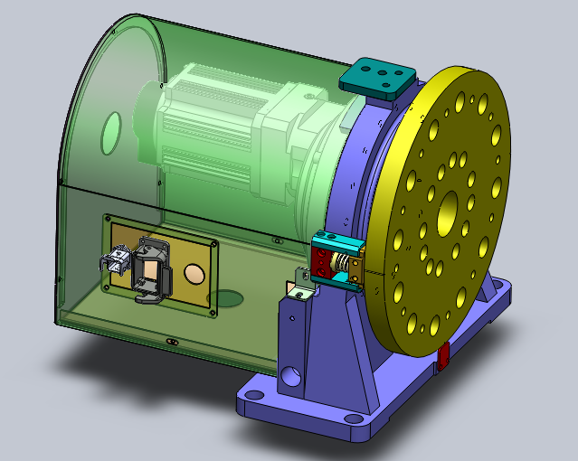
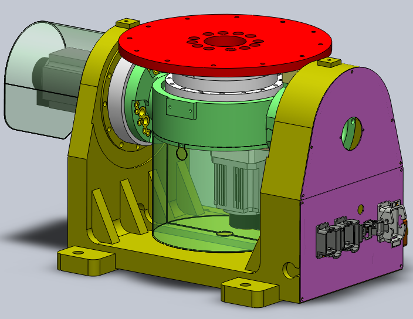

# 1. 개요

포지셔너(positioner) 동기기능은 로봇 외부에 설치된 지그 장치 동작에 동기화하여 로봇이 추종하거나 그 지그장치에 대해 상대적인 직선 혹은 원호 동작을 가능하게 하는 기능입니다. 포지셔너 동기 기능에 적용되는 외부 지그 장치를 포지셔너라고 칭하며, 스테이션(station)이라고도 합니다. 

본 기능을 적용하면 로봇의 작업영역의 제한으로 인해 작업이 어려운 부분을 보완할 수 있습니다. 즉, 작업물이 포지셔너 위에 고정되어 있는 상태에서 포지셔너가 이동하더라도 로봇은 이 포지셔너의 움직임을 추종하면서 작업물 위에서 직선 또는 원호의 동작을 수행하게 됩니다. 

주요 기능 사양은 아래와 같습니다.
|   **주요 기능 사양**  | **특징**                            |
|   -                   | -                                  |
|    포지셔너 그룹      | 1~4 그룹 지원                        |
|    포지셔너 축 수     | 1축, 2축 포지셔너 지원(회전축, 직동축) |
|    보간 방식          | 직선, 원호 보간 지원                  |

|  |  |
|:-: | :-:|             
|1축 회전 포지셔너|  2축 회전 포지셔너   |

