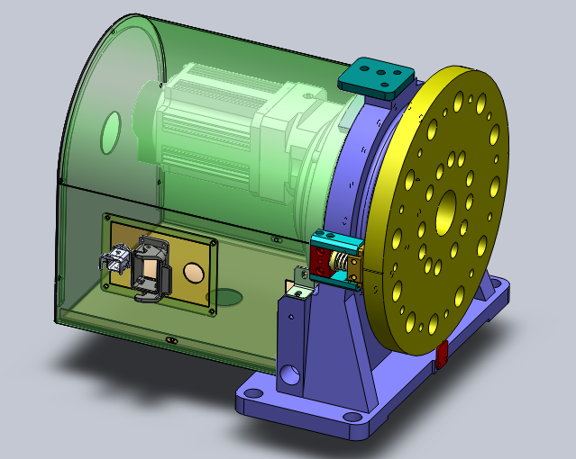
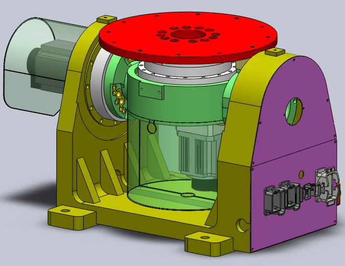

# 1. 概述

Positioner Synchronization Function 使机器人能够相对于安装在机器人外部的外部夹具单元执行线性或圆周运动。应用于位置器同步功能的外部夹具单元称为位置器，也称为站点。

应用这些功能可以补偿由机器人的工作区域限制引起的工作限制。换句话说，即使工件固定在位置器上，而位置器移动，机器人也会跟踪这个运动并在工件上执行线性或圆周运动。

关键功能规格如下： 
| **关键特性规格** | **特性** |
| - | - |
| 位置器组 | 支持 1~4 组 |
| 位置器轴 | 支持 1 轴、2 轴位置器（直接驱动，旋转） |
| 插值方法 | 支持线性、圆形插值 |

 

<table>
  <tr>
    <td align="center" width="50%">
      
       
      <em>图 1.0.1. 1轴旋转位置器</em>
    </td>
    <td align="center" width="50%">
      
       
      <em>图 1.0.2. 2轴旋转位置器</em>
    </td>
  </tr>
</table>

<!-- 
|  |  |
|:-: | :-:|             
|1轴旋转位置器|  2轴旋转位置器   |
 -->