# 2.1 System Initialization

1. When setting up the controller for the first time, perform a system initialization.
  navigate to `System > 5: Initialization > 1: System format` and press the initialize button.

<!-- 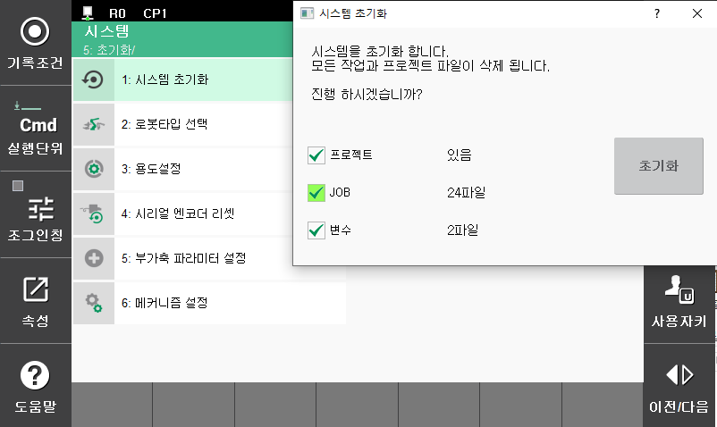 -->

 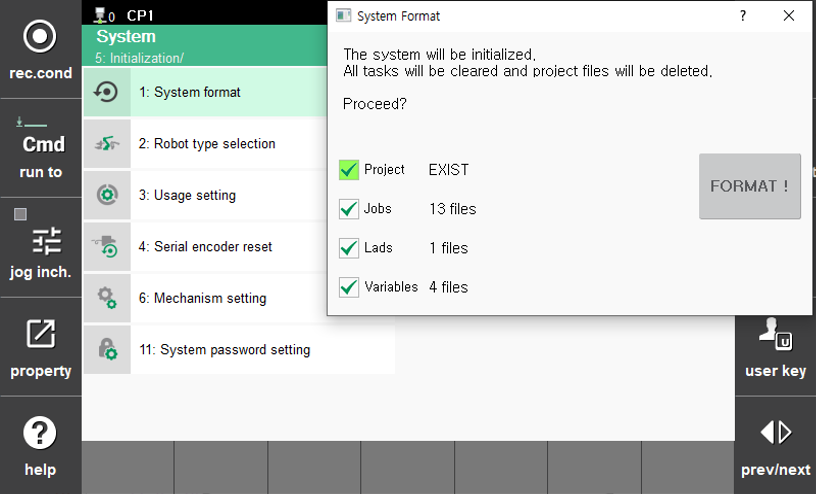</img>
 <em>
Figure 2.1.1. System Initialization
</em>

   
 

2. After System Initialization, select the robot type.
  Once the robot type is selected, the screen shown bellow will apper. Enter the total number of auxiliary axes to be used. After completing the settings, press the Confirm button.

 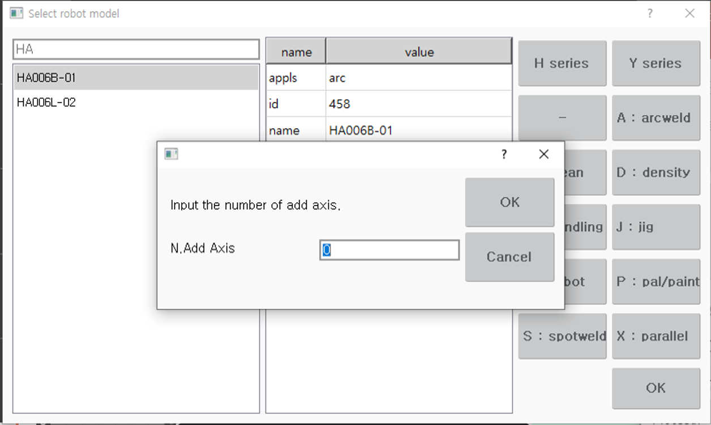</img>
 <em>
Figure 2.1.2. Robot type Select
</em>

   
 

<!-- 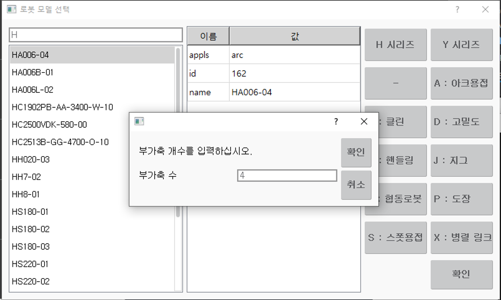
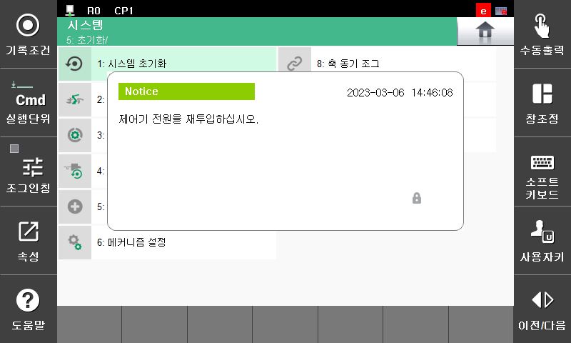 -->

3. Power on the controller.

 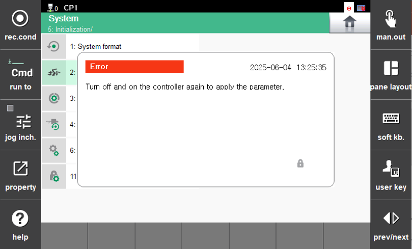</img>
 <em>
Figure 2.1.3. Reboot
</em>

   
 

4. After the controller boots up, navigate to `System > 5: Initialization > 5: Additional axis parameter setting` to configure the auxiliary axes.
  On this screen, set the auxiliary axes corresponding to positioners by selecting the axis specification as "Positioner" and configure the relevant parameters.
  Depending on the configuration of the positioner axis, select either linear or rotary axis.
  For linear axis, if the operating direction of the positioner axis is known relative to the robot base coordinates, specify the direction accordingly. If the exact direction is unknown, select arbitrarily.
  For rotary axis, if the positioner is not a standard one provided by the manufacturer, set the axis configuration to "Custom" and configure the remaining parameters.
  For detailed instructions on configuring auxiliary axes, please refer to the [Auxiliary Axis Function User Manual](https://hrbook-hrc.web.app/#/view/doc-add-axes/en/README?cont_model=${cont_model}).

<!-- 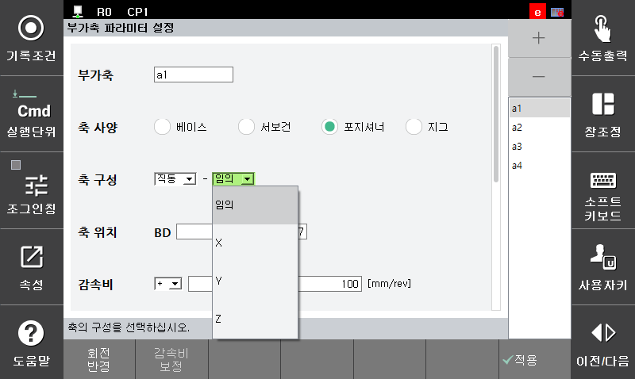
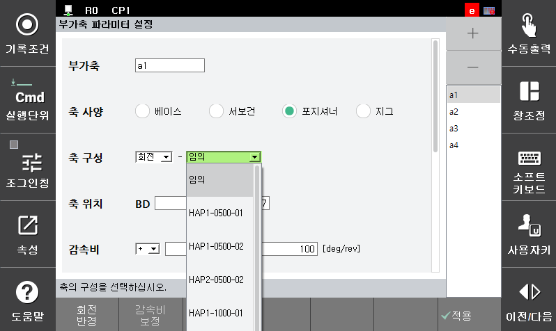 -->

 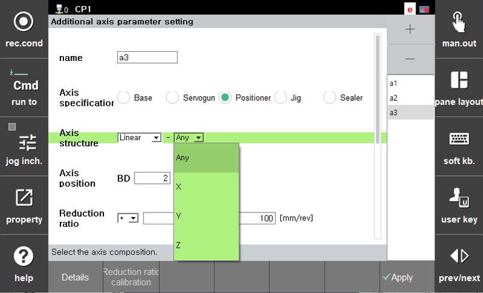</img>
 <em>
Figure 2.1.4. Linear Axis Parameter Configuration
</em>

   
 

 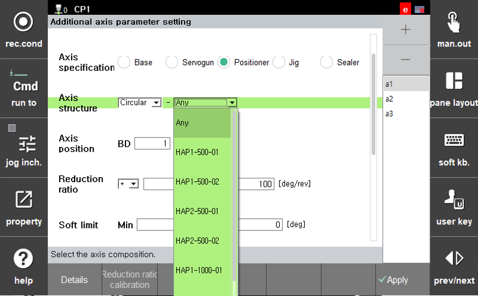</img>
 <em>
Figure 2.1.5. Rotary Axis Parameter Configuration
</em>

   
 

5. If the positioner is provided by our company, select the corresponding item from the axis configuration list.
  In this case, there is no need to configure any other parameters.

 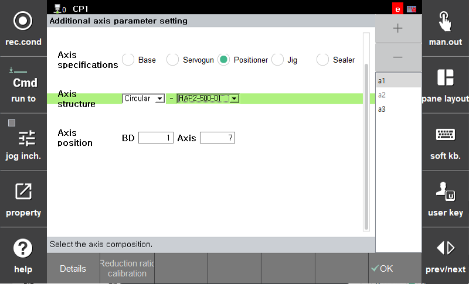</img>
 <em>
Figure 2.1.6. Standard Parameter Configuration
</em>

   
 

<!-- 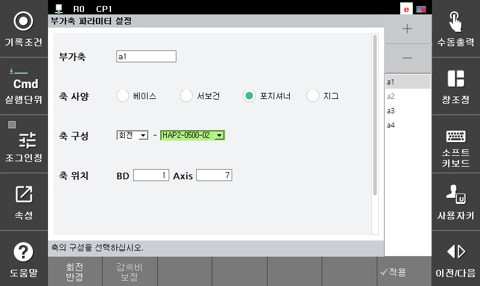 -->

6. Navigate to `System > 4: Application parameters > 3: Positioner synchronization` to configure the positioner groups.
  As an example, one 2-axis positioner and two 1-axis positioners are configured.
  Since three stations are required, you need to add stations. Clicking the '+' button will create stations in the list window.
  Select each station and enter the auxiliary axis number to configure the station. For 1-axis positioners, enter the auxiliary axis number only in the first field.
  In the figure below, auxiliary axes a1 and a2 correspond to the 2-axis positioner at Station 1, a3 corresponds to the 1-axis positioner at Station 2, and a4 corresponds to the 1-axis positioner at Station 3.

<!-- 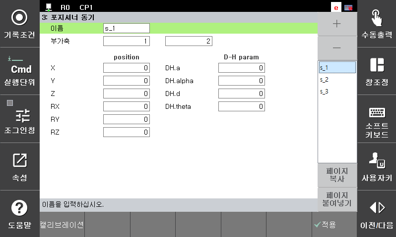  
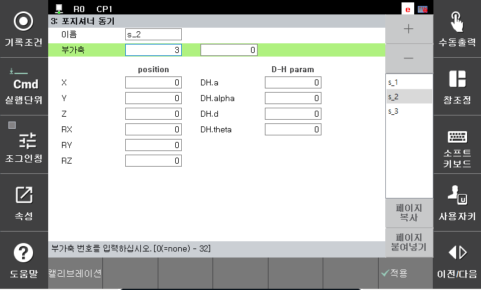  
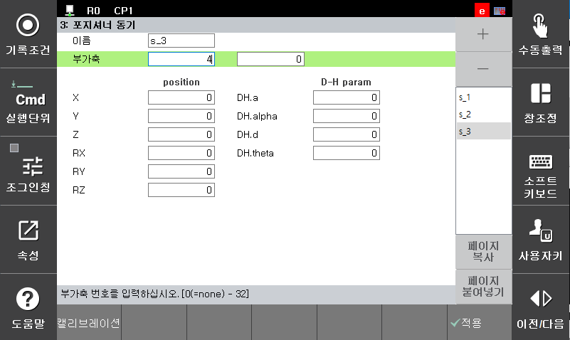   -->

 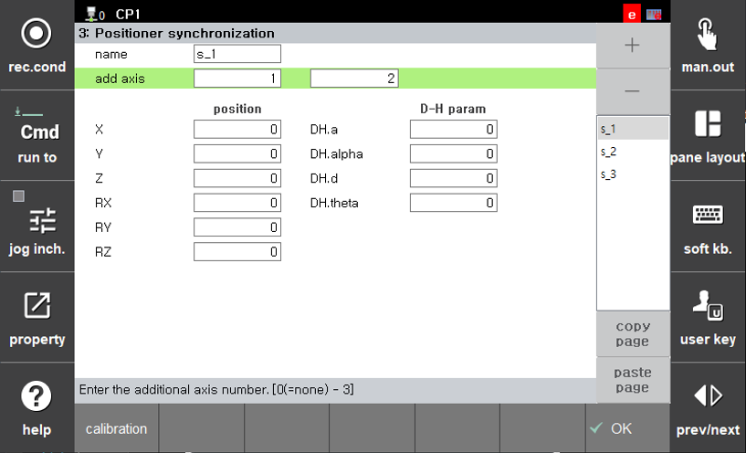</img>
 <em>
Figure 2.1.7. Auxiliary Axis a1, a2 Setting
</em>

   
 

 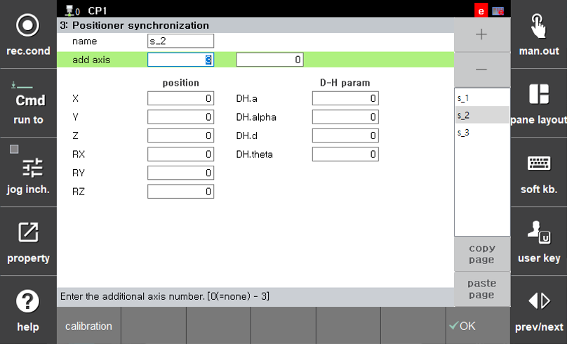</img>
 <em>
Figure 2.1.8. Auxiliary Axis a3 Setting
</em>

   
 

 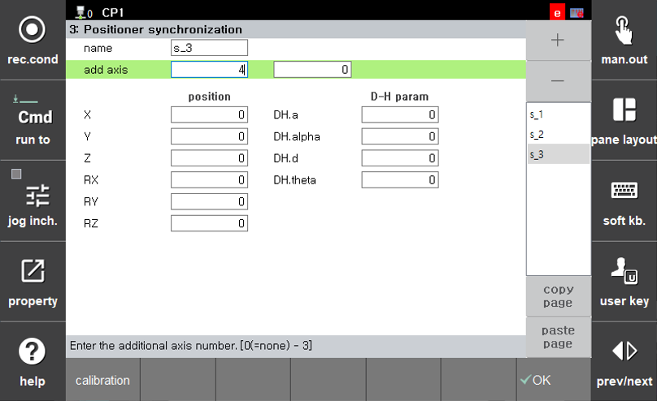</img>
 <em>
Figure 2.1.9. Auxiliary Axis a4 Setting
</em>

   
 

7. Navigate to `System > 5: Initialization > 6: Mechanism Settings` to configure the mechanism for jogging the positioner by each station.  

<!-- 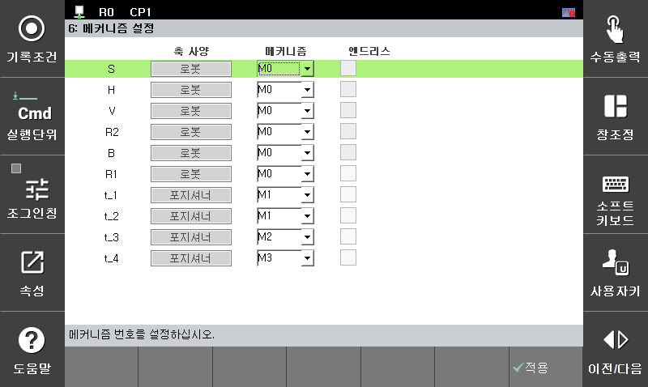 -->

 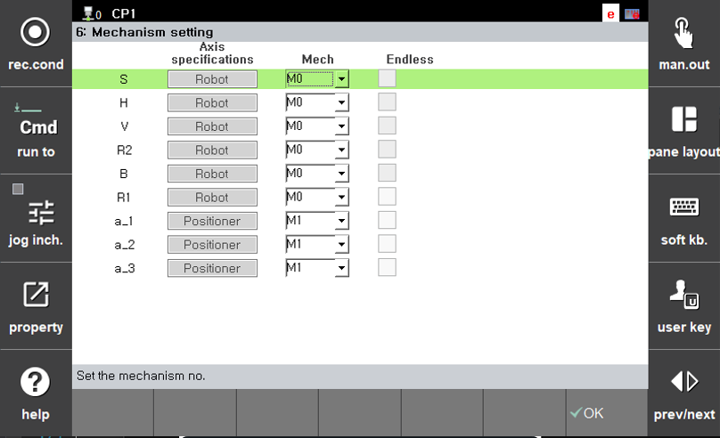</img>
 <em>
Figure 2.1.10. Mechanism Setting
</em>

   
 

8. Power cycle the controller to apply the auxiliary axis, station, and mechanism settings correctly.

