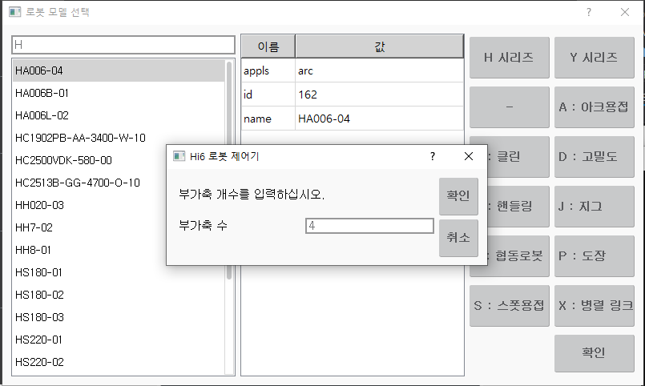
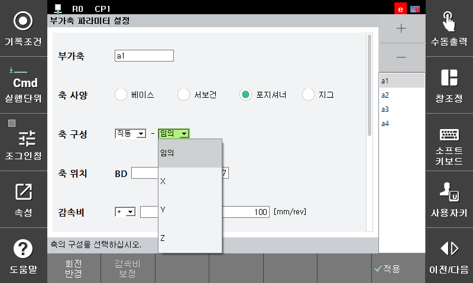

# 2.1 시스템 초기화
1. 제어기를 처음으로 설정하는 경우에는 시스템 초기화를 수행합니다.
[**시스템 > 초기화 > 시스템 초기화**]를 선택하고 초기화 버튼을 누릅니다.

2. 시스템 초기화 이후에는 로봇 타입을 선택합니다. 로봇 타입을 선택하면 다음 화면이 나타납니다. 이때 사용할 총 부가축의 개수를 입력합니다. 설정이 완료되면 확인 버튼을 누릅니다.

3. 제어기 전원을 재투입합니다.

4. 제어기 부팅이 완료된 후 [**시스템 > 초기화 > 부가축 파라미터 설정**] 메뉴에 진입해 부가축을 설정합니다. 이 화면에서 포지셔너에 해당하는 부가축은 축 사양을 포지셔너로 설정하고 해당하는 파라미터를 설정합니다. 포지셔너 축의 구성 형태에 따라 직동 또는 회전 축을 선택 하십시오. 직동 축인 경우 로봇 베이스 좌표 기준으로 포지셔너 축의 동작 방향을 알고 있는 경우 방향을 지정 할 수 있습니다. 정확한 방향을 알수 없는 경우 임의로 선택 하십시오. 회전 축의 경우 당사가 제공하는 표준 포지셔너가 아닌 경우에는 축 구성을 ‘임의’로 설정하고 나머지 파라미터를 설정합니다. 부가축 파라미터 설정 방법은 ‘부가축 기능 사용설명서’를 참고하십시오.

5. 만약 당사에서 제공하는 포지셔너인 경우에는 축 구성에서 해당 목록을 선택하십시오. 이 경우에는 다른 파라미터를 설정할 필요가 없습니다.

6. [**시스템 > 응용 파라미터 > 포지셔너 동기**]메뉴에서 포지셔너 그룹을 설정합니다. 
2축 포지셔너 1개, 1축 포지셔너 2개를 설정하는 경우를 예시로 들겠습니다. 
스테이션이 3개 필요하므로 스테이션을 추가해야 합니다. '+'버튼을 누르면 리스트 창에 스테이션이 생성됩니다.
각 스테이션을 선택하고 부가축 번호를 입력하여 스테이션을 설정합니다. 1축 포지셔너의 경우 첫번째 칸에만 부가축 번호를 입력합니다.
아래 그림에서는 부가축 a1, a2축은 2축 포지셔너로 스테이션 1이고 a3축은 1축 포지셔너로 스테이션 2, 마지막으로 a4축은 1축 포지셔너로써 스테이션 3으로 설정한 경우입니다.

7. [**시스템 > 초기화 > 메커니즘 설정**]메뉴에서 포지셔너를 스테이션별로 조그하기 위해 메커니즘을 설정합니다.

8. 제어기 전원을 재투입하면 부가축, 스테이션, 메커니즘 설정이 정상적으로 적용됩니다.