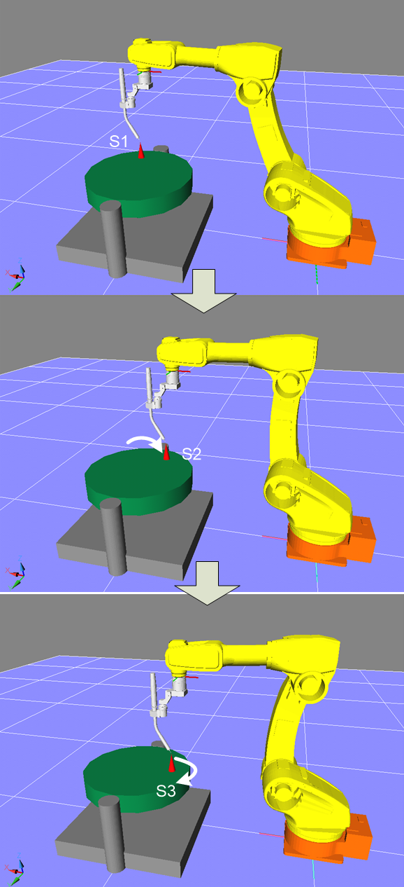

# 2.3.1 1축 포지셔너 캘리브레이션 프로그램 교시
1.	교시할 프로그램을 선택합니다.
2.	1축 포지셔너의 경우에는 포지셔너 위에 뾰족한 티칭점을 고정합니다. 이때 이 티칭점을 가능한 회전 중심과 멀리 설치하여야 캘리브레이션이 정확합니다.
3.	포지셔너를 30°정도씩 한 방향으로 회전시키면서 3점을 정확히 티칭하여 프로그램을 기록합니다. 티칭하는 방법은 아래의 그림과 같습니다.
직동 포지셔너의 경우는 가능한 멀리 떨어진 2점을 상기와 같은 방법으로 교시 합니다. 
4.	교시할 때 로봇의 자세는 가능하면 동일하게 합니다.

