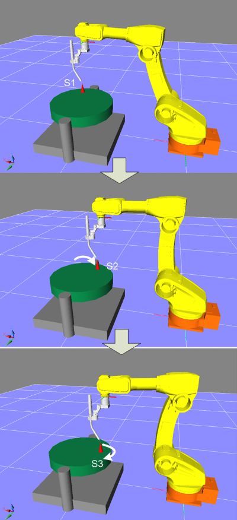

# 2.3.1 Teaching the 1-Axis Positioner Calibration Program

1. Select the program to be taught.

2. For a 1-Axis positioner, fix a pointed teaching point on the positioner. It is important to place this teaching point as far as possible from the rotation center to improve callibration accuracy.

3. Rotate the positioner approximately 30° in one direction and precisely teach three points to record the program. The teaching method is illustrated in the figure below.
  For a linear positioner, teach two points as far apart as possible using the same method.

4. When teaching, try to keep the robot's pose consistent.

<!--  -->

 </img>
 <em>
Figure 2.3.1. Teaching the 1-Axis Positioner Calibration
</em>

   
 