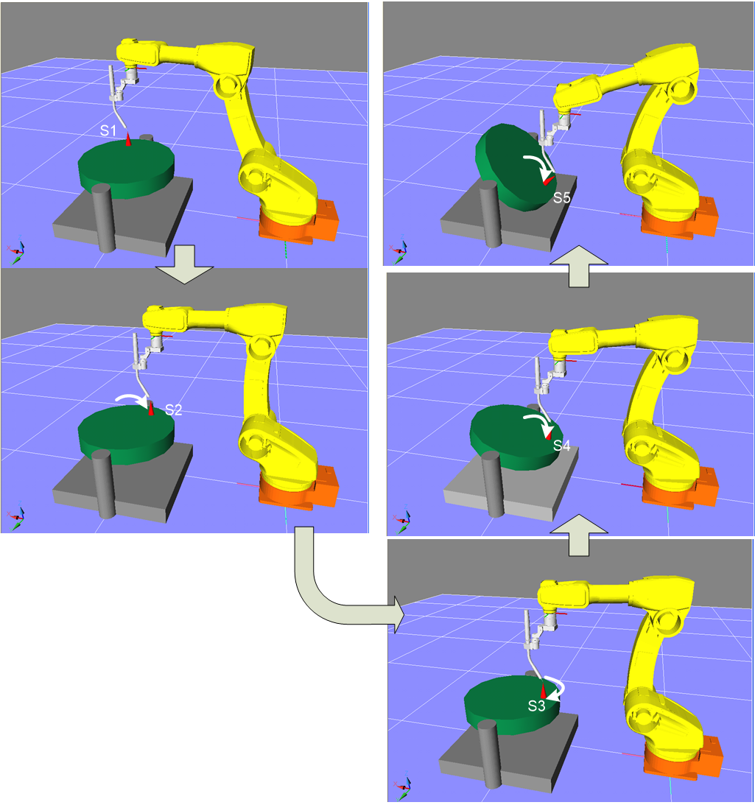

# 2.3.2 2축 포지셔너 캘리브레이션 프로그램 교시
1.	교시할 프로그램을 선택합니다.
2.	뾰족한 티칭점을 가능한 회전 중심과 멀리 설치합니다.
3.	2축 포지셔너의 경우에는 1축 포지셔너와 마찬가지로 두번째 축만 움직여 3점을 우선 교시합니다. 이 후에 3번째 교시점(S3)에서 첫번째 축만 이동하여 4번째 점과(S4) 5번째 점을(S5) 교시합니다. 직동 포지셔너의 경우 두번째 축에 대해 2점 교시 후 첫번째 축에 대해 이동 후 한점을 교시합니다. 
4.	교시를 할 때에는 로봇의 자세는 가능하면 변경하지 않고 교시하면 정확한 캘리브레이션이 됩니다.

