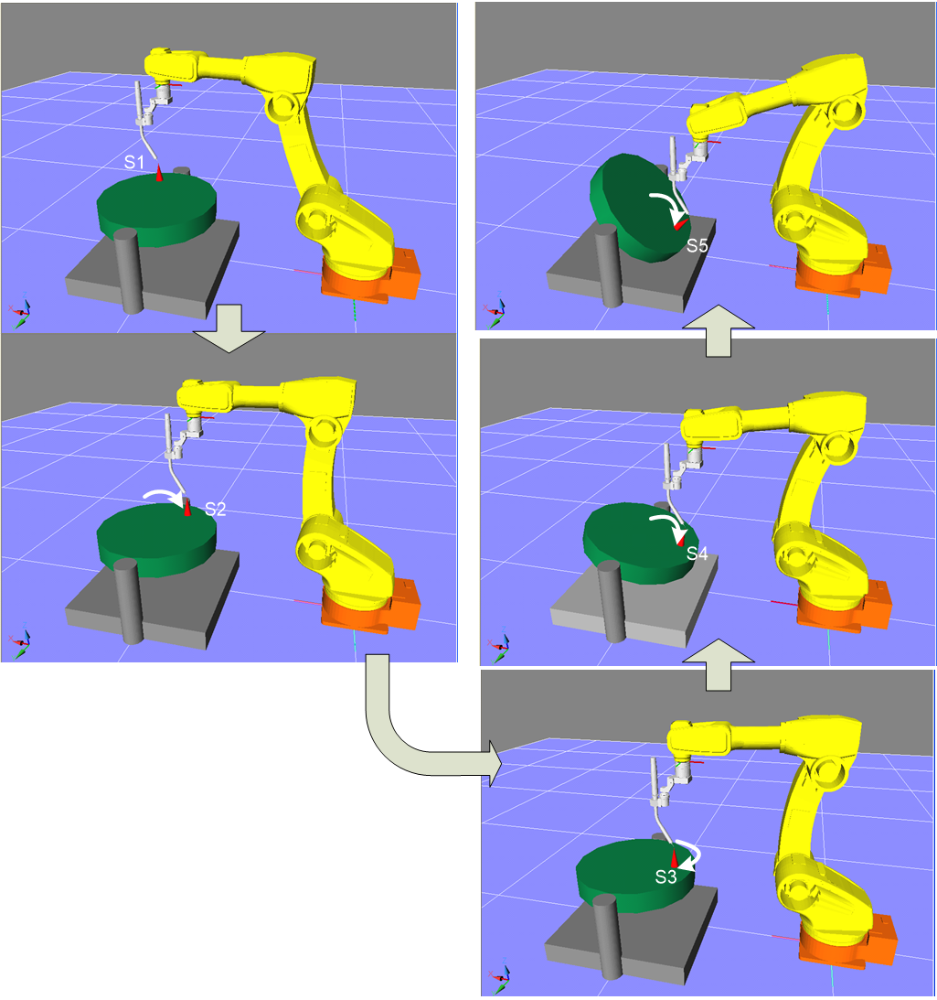

# 2.3.2 教学 2 轴定位器校准程序

1. 选择要教授的程序。

2. 将尖端教学点尽可能远离旋转中心。

3. 对于 2 轴定位器，类似于 1 轴定位器，首先仅移动 2 轴并教授三个点。
   然后，从第 3 个教学点（S3）开始，仅移动 1 轴以教授第 4（S4）和第 5（S5）个点。
   对于线性定位器，在 2 轴上教授两个点，然后移动 1 轴并教授一个点。

4. 教学时，尽量保持机器人姿态的一致性。

<!--  -->

 </img>
 <em>
图 2.3.2. 教学 2 轴定位器校准
</em>

   
 