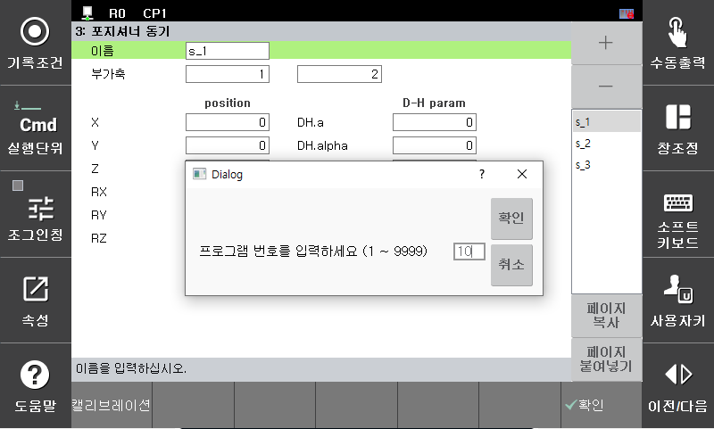
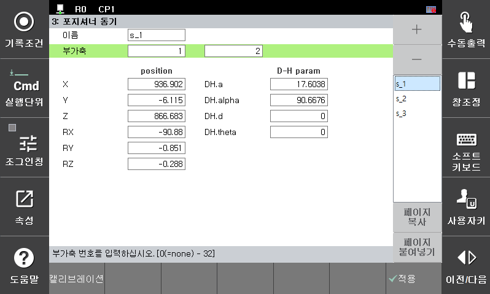

# 2.3.3 포지셔너 캘리브레이션 실행
1.	[**시스템 > 응용 파라미터 > 포지셔너 동기**]로 진입합니다.
2.	캘리브레이션 할 스테이션을 선택하고 캘리브레이션 버튼을 클릭하여 교시한 작업 프로그램 번호를 입력 합니다.

3.	캘리브레이션 결과가 표시됩니다. 우측의 『확인』키를 누르면 해당 데이터 설정이 완료됩니다. 

4.	사용자가 캐드데이터로 포지셔너의 위치를 정확히 알고 있는 경우 수동으로 포지셔너의 위치 및 DH파라미터를 설정한 후 『확인』키를 누르면 마찬가지로 데이터 설정이 반영됩니다.

5. [**3.2장 포지셔너 동기 조그 모드**](https://hrbook-hrc.web.app/#/view/doc-positioner-sync/korean/3-manual-operation/3-2-positioner-sync-jog-mode)에서 캘리브레이션이 정상적으로 수행되었는지 확인할 수 있습니다.