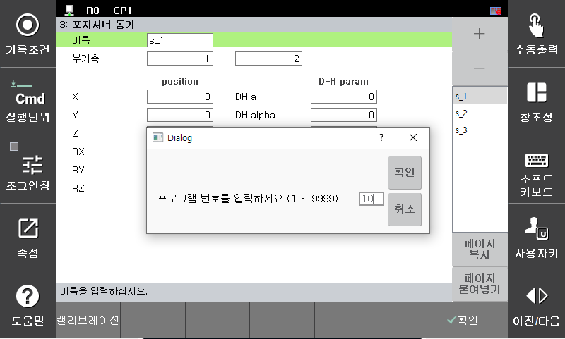
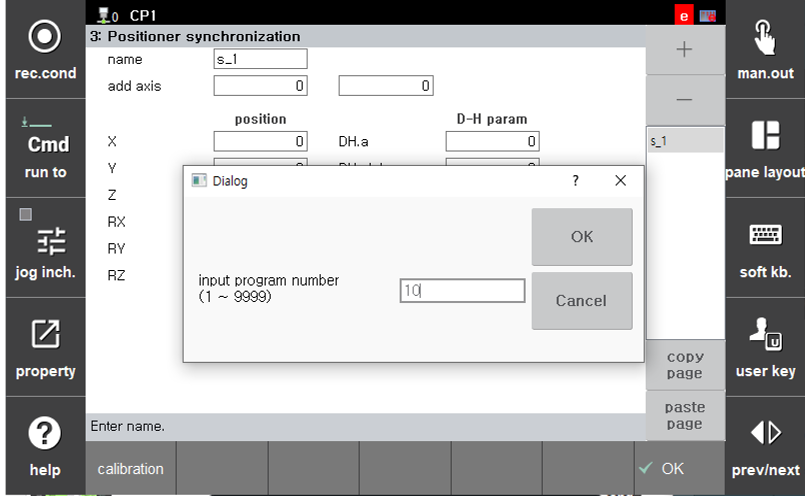
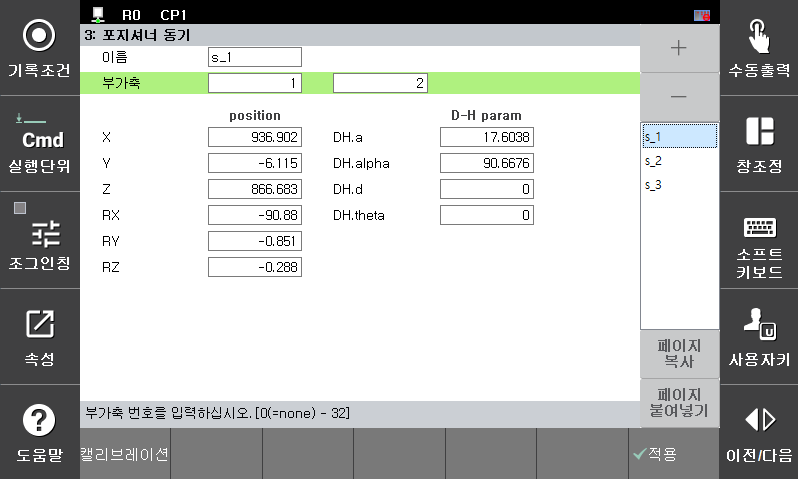
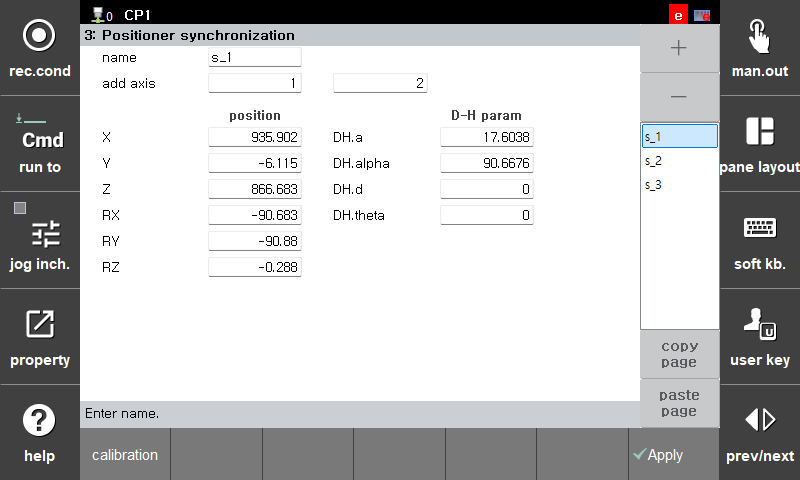

# 2.3.3 Executing Positioner Calibration

1. Enter the `System > 4: Application parameters > 3: Positioner synchronization`.
2. Select the station to be calibrated and click the calibration button to enter the taught program number.

<!--  -->

 </img>
 <em>
Figure 2.3.3. Executing Positioner Calibration
</em>

   
 

3. The calibration results will be displayed. Press the `[OK]` button on the right to finalize the data settings.

<!--  -->

 </img>
 <em>
Figure 2.3.4. Positioner Calibration Result
</em>

   
 

4. If the user knows the exact position of the positioner from CAD data, the position and DH parameters of the positioner can be manually set. Pressing the `[OK]` button will apply the data settings accordingly.

5. You can verify whether the calibration was performed correctly at the following link: [`3.2 Positioner Synchronized Jog Mode`](https://hrbook-hrc.web.app/#/view/doc-positioner-sync/en/3-manual-operation/3-2-positioner-sync-jog-mode?cont_model=${cont_model})
