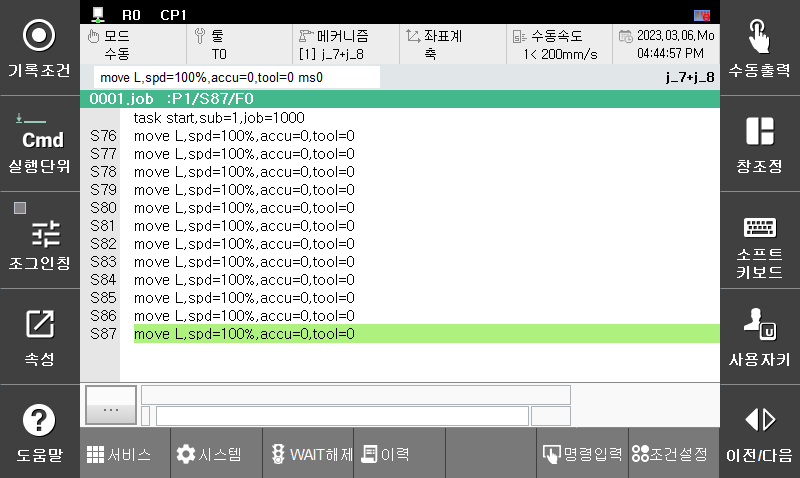
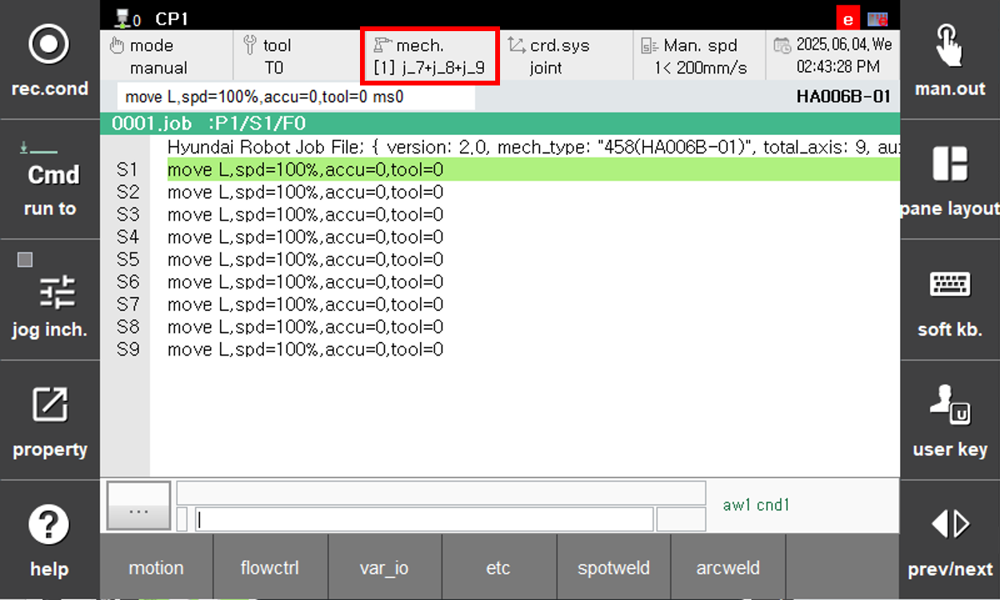

# 3.1 Positioner Independent Jog Mode

The independent jog mode is toggled by pressing the "mech." key on the teach pendant. When set to this mode, the positioner can be jogged independently as shown below.

<!--  -->

 </img>
 <em>
Figure 3.1.1. Positioner Independent Jog method
</em>

   
 

- Positioner mechanism: J7 + J8
- Coordinate system: Axis coordinate system (independent jog)
- Recording condition: General move command
