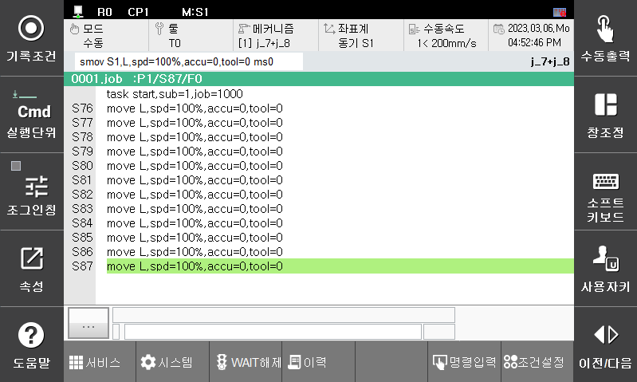
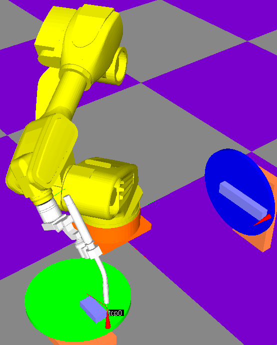

# 3.2 포지셔너 동기 조그 모드
포지셔너 동기조그는 포지셔너 캘리브레이션이 완료된 경우에만 사용 가능합니다. 
포지셔너 단독 조그 상태에서, 티칭 펜던트의 ‘좌표계’ 버튼을 누르면 ‘동기 S1’과 같이 표시됩니다. 이 상태에서 포지셔너를 움직이면 로봇이 포지셔너의 움직임에 따라오면서 조그 동작을 합니다. 

- 포지셔너 메커니즘: J7+J8
- 좌표계: 동기 좌표계(동기 조그)
- 기록 조건: smov 명령

