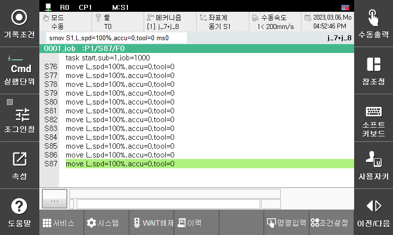
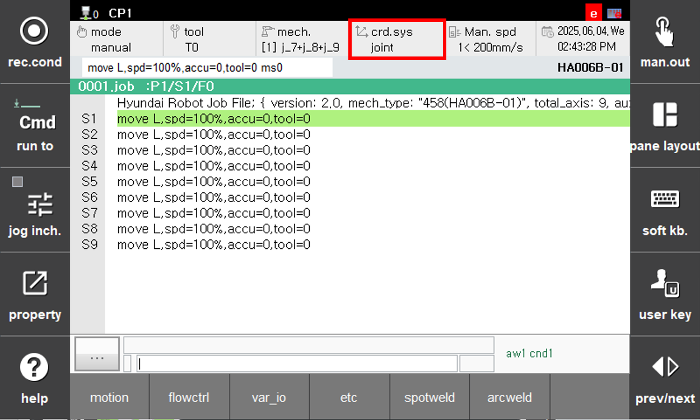
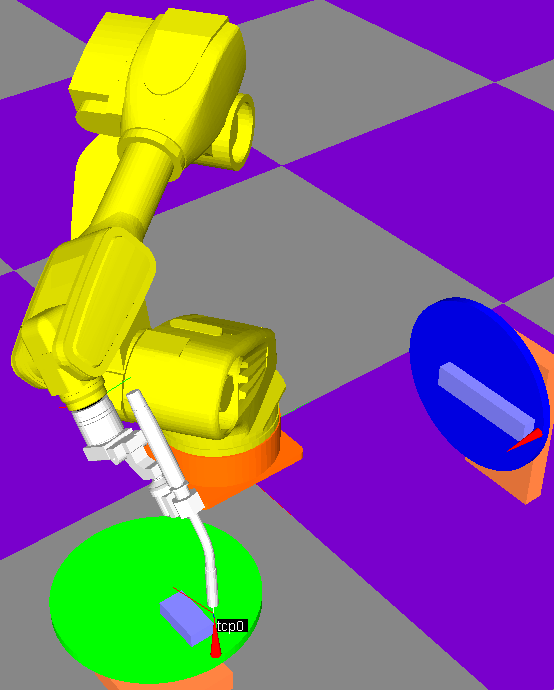

# 3.2 Positioner Synchronized Jog Mode

The positioner synchronized jog mode is available only after positioner calibration is completed.
While in the positioner independent jog mode, pressing the "crd.sys" button on the teach pendant will display "Synchronized S1". In this mode, when the positioner moves, the robot follows the positioner’s movement and performs synchronized jogging.

<!--  -->

 </img>
 <em>
Figure 3.1.2. Positioner Synchronized Jog Method
</em>

   
 

- Positioner mechanism: J7 + J8
- Coordinate system: Synchronized coordinate system (synchronized jog)
- Recording condition: smov command

<!--  -->

 </img>
 <em>
Figure 3.1.3. Positioner Operation Simulation
</em>

   
 
