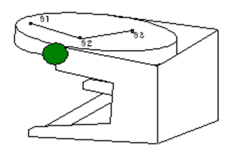
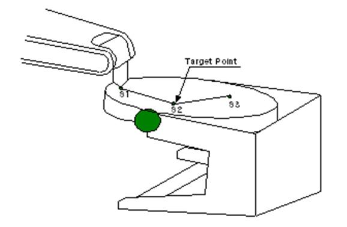
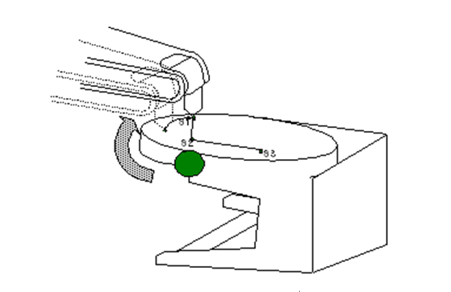
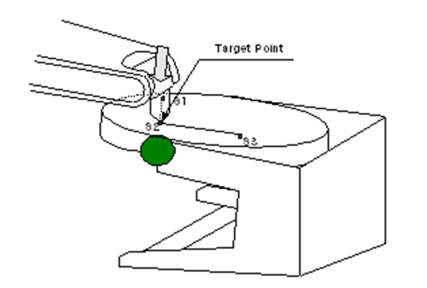
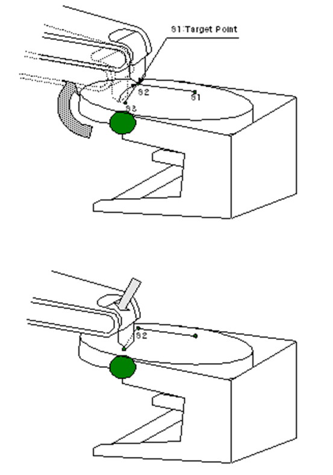
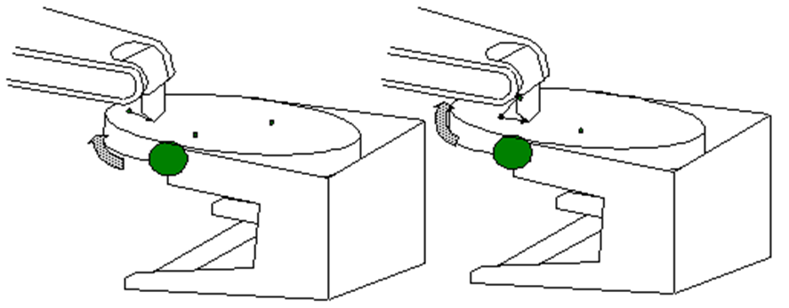

# 4.3 포지셔너 상의 직선보간 교시 예시

1. 대상물 위에 시작점 및 목표점을 결정합니다.

<!--  -->
<p style="text-align: left;">
  
  <em style="display: block; text-align: center; width: 40%; auto;">
    그림 4.1.1. 과정 1
  </em>
</p>
<br/>

2. 메커니즘 키와 좌표계를 이용하여 포지셔너를 선택하여 포지셔너를 이동시킨 후, 다시 메커니즘키로 로봇을 선택하여 시작점에 로봇 툴 끝을 원하는 시작점에 일치시킵니다. 이 상태에서 기록키를 눌러 ‘move’명령을 기록합니다(필요에 따라 smov로 기록하십시오).

3. 메커니즘 키와 좌표계 키를 이용하여 포지셔너 동기 조그 모드로 설정합니다. 현재 작업하는 포지셔너가 스테이션 1일 경우 좌표계가 ‘동기 S1’이 되도록 선택합니다.

<!--  -->
<p style="text-align: left;">
  
  <em style="display: block; text-align: center; width: 40%; auto;">
    그림 4.1.2. 과정 2~3
  </em>
</p>
<br/>

4. 마스터를 선택한 상태에서 포지셔너의 위치를 희망하는 위치로 변경하면, 로봇은 포지셔너 위의 작업 시작점을 따라 자세와 위치가 유지됩니다.

<!--  -->
<p style="text-align: left;">
  
  <em style="display: block; text-align: center; width: 40%; auto;">
    그림 4.1.3. 과정 4
  </em>
</p>
<br/>

5. (참고) 상기 상태에서 포지셔너 위의 한 점과 로봇 툴 끝의 오차는 로봇과 포지셔너의 캘리브레이션에 기인하는 오차이며, 이 오차가 재생시의 궤적오차로 나타나지는 않습니다. 즉, 어느 정도 오차량이 있을 지라도 로봇을 다시 움직여 목표위치로 로봇을 움직이고 “smov”로 기록하면, 재생시의 스텝의 궤적위치 오차는 거의 발생하지 않습니다.

6. 메커니즘을 다시 로봇으로 선택한 다음, Jog키로 로봇을 ‘목표점’(S2)까지 이동하여 일치시킵니다.

<!--  -->
<p style="text-align: left;">
  
  <em style="display: block; text-align: center; width: 40%; auto;">
    그림 4.1.4. 과정 6
  </em>
</p>
<br/>

7. 동기스텝(smov)을 기록하기 위해 다시 포지셔너 동기 조그 모드로 설정하여 좌표계가 ‘동기 S1’이 되도록 선택하고 [기록]키를 눌러서 “smov” 스텝을 기록합니다. 

8. 이후의 스텝도 ③→④→⑤의 과정을 따릅니다.

<!--  -->
<p style="text-align: left;">
  
  <em style="display: block; text-align: center; width: 40%; auto;">
    그림 4.1.5. 과정 7~8
  </em>
</p>
<br/>


9. 기록된 프로그램을 실행하면, 포지셔너가 이동하고 로봇은 포지셔너 위의 작업물에 대해 직선 보간으로 이동합니다.

<!--  -->
<p style="text-align: left;">
  
  <em style="display: block; text-align: center; width: 50%; auto;">
    그림 4.1.6. 과정 9
  </em>
</p>
<br/>


[**주의사항**]
1) 포지셔너 동기스텝(smov)의 기록은 반드시 위와 같은 방법으로 해야하는 것은 아닙니다. 로봇과 포지셔너를 단독으로 움직여 위치와 자세를 결정한 후 smov 스텝으로 기록하면 로봇은 포지셔너의 작업물 위에서 지정된 보간 방식으로 움직입니다.
2) smov 기록된 두 스텝의 보간방식이 둘 다 “L”인 경우 move에서와 같이 코너링 모션을 합니다.
3) smov로 기록된 스텝의 속도는 작업속도입니다. 따라서 포지셔너를 많이 움직였을 지라도 작업물위에 기록된 스텝간의 작업거리가 매우 짧으면 포지셔너이 작업속도가 거의 ∞(무한대)가 되므로 포지셔너가 최고속으로 움직이게 됩니다. 이와 같은 경우 포지셔너의 속도를 제한하고자 할 경우에는 속도 단위를 “SEC”로 설정하면 됩니다. 이 의미는 스텝을 이동하는 단위가 속도가 아닌 시간으로 설정하기 때문에 작업물상의 작업거리가 0일지라도 이동시간이 지정되기 때문입니다.
<br/><br/>
 
[**프로그램 작성 예시**]
```py

    S1   move  L,spd=60%,accu=1,tool=0		# 시작 위치 접근 스텝
    S2   smov  S1,L,spd=100mm/s,accu=1,tool=0	# 포지셔너 동기 직선 보간
    S3   smov  S1,L,spd=100mm/s,accu=1,tool=0
    S4   smov  S1,L,spd=100mm/s,accu=1,tool=0
    S5   move  P,spd=10%,accu=1,tool=0		# 퇴피 스텝(포지셔너와 비동기)
    S6   move  L,spd=200mm/s,accu=1,tool=0 
    end

```
