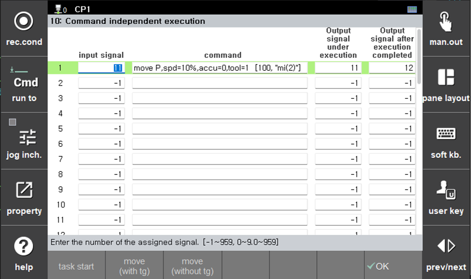

# 5.1 System Settings

1. Navigate to the `System - Application Parameter - Command Independent execution`.  
  
    - Input Signal  
    Configure the signal input to the controller.

    - Command  
    Specify the command to be executed when the input signal changes from OFF to ON. For independent operation of the positioner, a move command is used.  

    - Ouput Singal under Execution  
    This signal turns On when execution of the specified command starts and turns OFF when execution is completed.  

    - Output Signal After Execution Completed  
    This signal turns OFF when execution of the specified command starts and turns ON when execution is completed.  
    For more details on Independent Command Execution, refer to [${cont_model} Controller Operation Manual - 7.5.10 Command independent execution](https://hrbook-hrc.web.app/#/view/doc-hi6-operation/en-tp630/7-system/5-application-parameter/10-cmd-idp-exe?cont_model=${cont_model}).  
  
2. In the Command field, press the button below to enter a move command. To execute an auxiliary axis move independently, the mechanism must be specified in the move command.  
    For more details on entering move commands, refer to [${cont_model} Controller Operation Manual - Robot Language HRScript - 5.1 Pose](https://hrbook-hrc.web.app/#/view/doc-hrscript/en/5-moving-robot/1-pose?cont_model=${cont_model}).  

3. Set the axis to be operated independently using the axisctrl off command. The axisctrl command is used to select whether an auxiliary axis is controlled by the task program. An axis set to axisctrl off does not move to the positions recorded in the task program and can be moved independently. An axis set to axisctrl on moves according to the positions recorded in the task program.  
    Independent execution of move commands by external input signals is valid only in the section between axisctrl off and axisctrl on. When an input signal specified in Independent Command Execution is received while axisctrl off is active, the move command is executed. Axes set to axisctrl off are displayed in yellow text, such as j_7 shown at the top of the figure below.  
      
    For more details, refer to [${cont_model} Controller Manual - Multi-tasking - 2.1.6 axisctrl](https://hrbook-hrc.web.app/#/view/doc-multi-task/en/2-related-function/2-1-command-sentence/6-axisctrl?cont_model=${cont_model}).  

  

1. The mechanism specified in the move command for Independent Command Execution must consist only of axes set to axisctrl off.

2. If the axisctrl on command is executed before the independent execution is completed, the error **'E1455 (Axis 0) Independent operation not completed'** occurs and the robot axes are stopped. In this case, the independently operated axis continues moving to its target position.  

    This occurs because the execution time of the robot task program is shorter than the execution time of the independent move command. Modify the program accordingly, or insert a wait command before the axisctrl on command to check whether the independent execution completion signal has been output.


