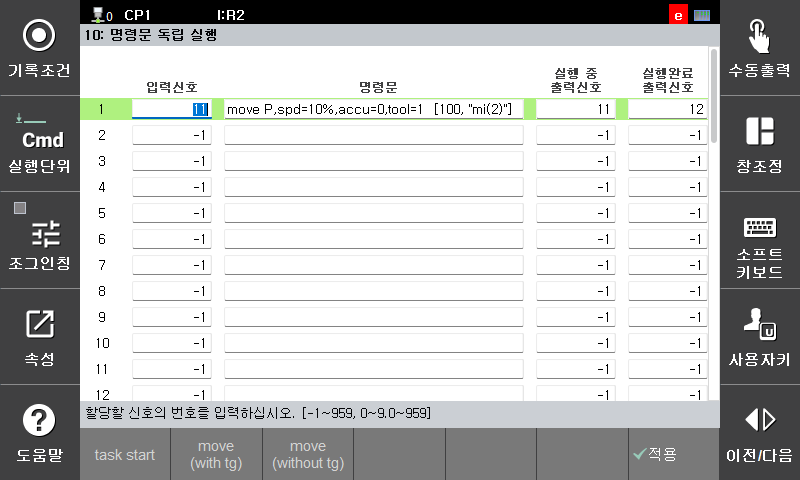
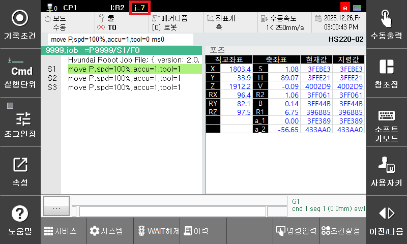

# 5.1 시스템 설정
1. [**시스템 > 응용 파라미터 > 명령문 독립 실행**] 메뉴에 진입합니다.

    - 입력 신호  
    제어기에 입력되는 신호를 설정합니다.  

    - 명령문  
    입력 신호가 OFF에서 ON될때 실행할 명령문을 기록합니다. 포지셔너 독립운전을 위해서는 move가 사용됩니다.  

    - 실행 중 출력신호  
    해당 명령문의 실행을 시작하면 ON되고, 실행이 완료되면 OFF됩니다.  

    - 실행완료 출력신호  
    해당 명령문의 실행을 시작하면 OFF되고, 실행이 완료되면 ON됩니다.  
    명령문 독립실행 관련한 자세한 내용은 [Hi6 로봇제어기 조작설명서 - 7.5.10 명령문 독립 실행](https://hrbook-hrc.web.app/#/view/doc-hi6-operation/korean-${cont_model}-tp630/7-system/5-application-parameter/10-cmd-idp-exe)를 참고하십시오.
  
2. 명령문 항목에 하기 버튼을 눌러 move문을 입력합니다.  
    부가축 move 명령을 독립적으로 수행시키기 위해서는 move문에 메커니즘을 지정해야 합니다.  
    move문 입력 관련한 자세한 내용은 [Hi6 로봇제어기 기능설명서 - 로봇언어 HRScript - 5.1 포즈 (pose)](https://hrbook-hrc.web.app/#/view/doc-hrscript/korean-${cont_model}/5-moving-robot/1-pose)를 참고하십시오.

3. 부가축 move 독립 실행을 수행할 축을 axisctrl off 명령으로 설정합니다.  
    axisctrl 명령은 작업 프로그램에 의해 부가축의 제어를 할 것인지 여부를 선택하는 명령입니다. axisctrl off된 축은 작업 프로그램에 기록된 위치로 이동하지 않고 독립적으로 이동할 수 있습니다. axisctrl on된 축은 작업 프로그램에 기록된 위치로 이동합니다.  
    외부 입력 신호에 의한 move 독립 실행은 axisctrl off ~ axisctrl on 사이에 해당하는 부분에서만 유효합니다 axisctrl off인 상태에서, 명령문 독립실행에서 지정한 입력신호가 들어올 경우 move문을 수행합니다. axisctrl off인 축은 하기 그림 상단의 j_7과 같이 노란색 글씨로 표시됩니다.
    
    자세한 내용은 [Hi6 로봇제어기 기능설명서 - 멀티태스킹 - 2.1.6 axisctrl](https://hrbook-hrc.web.app/#/view/doc-multi-task/korean/2-related-function/2-1-command-sentence/6-axisctrl)을 참고하십시오.

  

1. 명령문 독립실행에서 지정한 move의 메커니즘은 axisctrl off된 축으로만 구성되어 있어야만 합니다.   
2. axisctrl on 명령을 실행할 때 아직 독립실행이 완료되지 않은 경우에는 ‘E1455 (0축) 독립 
운전이 종료되지 않음’ 에러가 발생하고 로봇 축은 정지합니다. 이때 독립 운전 축은 해당 위치까지 이동합니다.  
이는 독립 move 명령을 실행하는 시간보다 로봇의 작업프로그램의 실행 시간이 빠른 것이므로 프로그램을 조정하거나 axisctrl on 명령 위에 wait 명령을 이용하여 move 독립 실행 완료 신호가 출력된 경우를 검사하도록 변경하십시오.  


